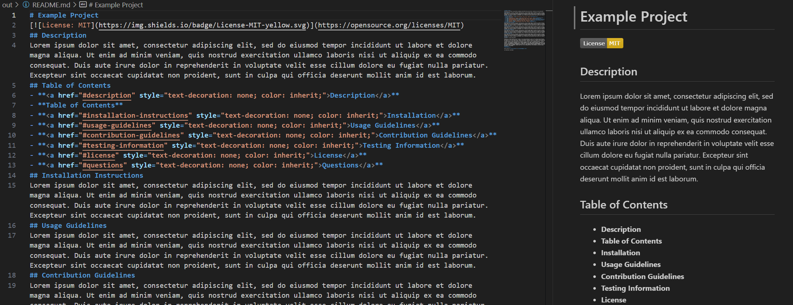

# Node.js Challenge: Professional README Generator

Click image of application preview to access application!

URL: [https://github.com/ANAZ0004/professional-readme-generator](https://github.com/ANAZ0004/professional-readme-generator)
## User Story

* AS A developer
* I WANT a README generator
* SO THAT I can quickly create a professional README for a new project

## Acceptance Criteria

* GIVEN a command-line application that accepts user input
* WHEN I am prompted for information about my application repository
  - [x] THEN a high-quality, professional README.md is generated with
    - [x] the title of my project
    - [x] sections entitled
      - [x] Description
      - [x] Table of Contents
      - [x] Installation
      - [x] Usage
      - [x] Contributing
      - [x] Tests
      - [x] License
      - [x] Questions
* WHEN I enter my project title
  - [x] THEN this is displayed as the title of the README
* WHEN I enter a description, installation instructions, usage information, contribution guidelines, and test instructions
  - [x] THEN this information is added to the sections of the README entitled
    - [x] Description
    - [x] Installation
    - [x] Usage
    - [x] Contributing
    - [x] Tests
* WHEN I choose a license for my application from a list of options
  - [x] THEN
    - [x] a badge for that license is added near the top of the README
    - [x] a notice is added to the section of the README entitled License that explains which license the application is covered under
* WHEN I enter my GitHub username
  - [x] THEN
    - [x] this is added to the section of the README entitled Questions
    - [x] with a link to my GitHub profile
* WHEN I enter my email address
  - [x] THEN
    - [x] this is added to the section of the README entitled Questions
    - [x] with instructions on how to reach me with additional questions
* WHEN I click on the links in the Table of Contents
  - [x] THEN I am taken to the corresponding section of the README
